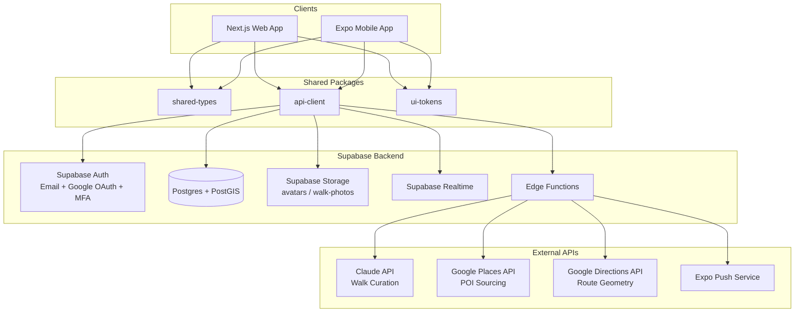
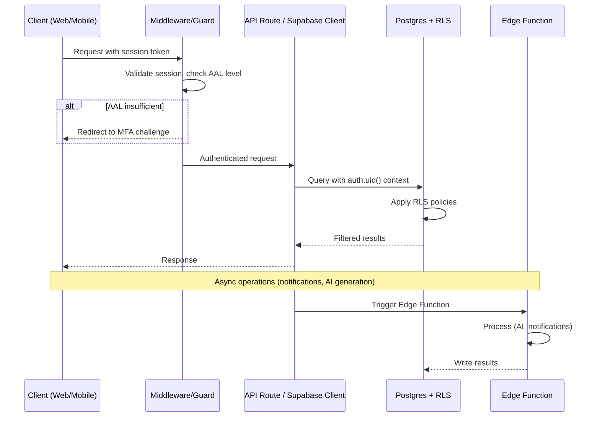

# Design Document: Wander v2 Social Walk

## Overview

Wander v2 extends the existing walk generation engine with a social layer, discovery system, and cross-platform mobile experience. The design follows a monorepo architecture with a Supabase backend providing authentication, real-time data, spatial queries, and storage. The system serves two clients (Next.js web and Expo mobile) through shared packages and a unified API layer.

### Key Design Decisions

1. **Supabase as unified backend** — provides Auth (with MFA), Postgres + PostGIS, Storage, Realtime subscriptions, and Edge Functions in a single managed service, reducing operational complexity.
2. **Turborepo + pnpm monorepo** — enables code sharing (types, API client, design tokens) between web and mobile while maintaining independent build pipelines.
3. **Cursor-based pagination** — chosen over offset-based for feed and discovery queries to handle real-time insertions without skipping or duplicating items.
4. **RLS as primary access control** — database-level security ensures no API bypass can leak data, with application-layer checks as defense-in-depth.
5. **PostGIS spatial indexing** — enables efficient viewport-based discovery queries with GiST indexes on route geometry and start points.
6. **Edge Functions for async work** — push notifications, AI walk generation, and image processing run as serverless functions to keep client responses fast.

## Architecture

### High-Level System Architecture



### Monorepo Structure

```
wander-v2/
├── apps/
│   ├── web/                    # Next.js 14+ App Router
│   │   ├── app/
│   │   │   ├── (auth)/         # Auth routes (login, signup, mfa)
│   │   │   ├── (main)/         # Protected routes
│   │   │   │   ├── feed/
│   │   │   │   ├── discover/
│   │   │   │   ├── walk/[walkId]/
│   │   │   │   └── profile/[username]/
│   │   │   └── api/            # API routes (Next.js Route Handlers)
│   │   ├── middleware.ts       # AAL checking, session refresh
│   │   └── lib/
│   └── mobile/                 # Expo (React Native)
│       ├── app/                # Expo Router (file-based routing)
│       │   ├── (auth)/
│       │   ├── (tabs)/
│       │   │   ├── feed/
│       │   │   ├── discover/
│       │   │   ├── walk/
│       │   │   └── profile/
│       │   └── walk/[walkId]/
│       └── lib/
├── packages/
│   ├── shared-types/           # TypeScript interfaces and enums
│   ├── api-client/             # Typed Supabase client + query functions
│   └── ui-tokens/              # Design tokens (colors, spacing, typography)
├── supabase/
│   ├── migrations/             # SQL migrations (schema, RLS, indexes)
│   └── functions/              # Edge Functions
├── turbo.json
├── pnpm-workspace.yaml
└── package.json
```

### Request Flow



## Components and Interfaces

### Package: shared-types

Defines all TypeScript interfaces shared between web and mobile:

```typescript
// Core domain types
export interface User {
  id: string;
  username: string;
  display_name: string;
  avatar_url: string | null;
  bio: string | null;
  created_at: string;
}

export interface Profile extends User {
  total_walks: number;
  total_distance_km: number;
  favorite_vibes: VibeTag[];
  badges: Badge[];
  follower_count: number;
  following_count: number;
}

export type VibeTag = 'cozy' | 'urban' | 'nature' | 'historic' | 'artsy' | 'foodie' | 'nightlife' | 'scenic' | 'adventure' | 'hidden-gems';

export type VisibilitySetting = 'public' | 'friends_only' | 'private';

export interface Walk {
  id: string;
  user_id: string;
  title: string;
  narrative: string;
  visibility: VisibilitySetting;
  vibe_tags: VibeTag[];
  duration_minutes: number;
  distance_km: number;
  route_geometry: GeoJSON.LineString;
  start_point: GeoJSON.Point;
  created_at: string;
  completed_at: string | null;
  like_count: number;
  comment_count: number;
  photos: WalkPhoto[];
  stops: Stop[];
}

export interface Stop {
  id: string;
  walk_id: string;
  name: string;
  description: string;
  narrative: string;
  position: GeoJSON.Point;
  order_index: number;
  visited: boolean;
  visited_at: string | null;
  place_id: string | null; // Google Places ID
}

export interface WalkPhoto {
  id: string;
  walk_id: string;
  stop_id: string | null;
  storage_path: string;
  url: string;
  captured_at: string;
}

export interface FeedCard {
  walk_id: string;
  user: Pick<User, 'id' | 'username' | 'display_name' | 'avatar_url'>;
  narrative_snippet: string;
  route_thumbnail_url: string;
  distance_km: number;
  duration_minutes: number;
  vibe_tags: VibeTag[];
  like_count: number;
  comment_count: number;
  is_liked_by_viewer: boolean;
  created_at: string;
}

export interface Comment {
  id: string;
  walk_id: string;
  user_id: string;
  user: Pick<User, 'id' | 'username' | 'display_name' | 'avatar_url'>;
  text: string;
  created_at: string;
}

export interface FollowRelationship {
  follower_id: string;
  following_id: string;
  created_at: string;
}

export interface Badge {
  id: string;
  name: string;
  description: string;
  icon_url: string;
  earned_at: string;
}

// API request/response types
export interface FeedRequest {
  cursor?: string;
  limit?: number; // default 20
}

export interface FeedResponse {
  items: FeedCard[];
  next_cursor: string | null;
}

export interface DiscoverRequest {
  viewport: Viewport;
  vibe_tag?: VibeTag;
  radius_km?: number;
  sort?: 'recent' | 'popular';
  cursor?: string;
  limit?: number;
}

export interface Viewport {
  north: number;
  south: number;
  east: number;
  west: number;
}

export interface DiscoverResponse {
  walks: WalkMapItem[];
  next_cursor: string | null;
}

export interface WalkMapItem {
  id: string;
  title: string;
  start_point: GeoJSON.Point;
  route_geometry: GeoJSON.LineString;
  vibe_tags: VibeTag[];
  distance_km: number;
  duration_minutes: number;
  like_count: number;
  user: Pick<User, 'username' | 'display_name' | 'avatar_url'>;
}

export interface WalkGenerationRequest {
  duration_minutes: number;
  vibe_tags: VibeTag[];
  start_location: GeoJSON.Point;
}

export interface NotificationPreferences {
  new_follower: boolean;
  walk_liked: boolean;
  walk_commented: boolean;
  stop_arrival: boolean;
}
```

### Package: api-client

Typed Supabase client wrapper exposing domain-specific query functions:

```typescript
// Core client factory
export function createSupabaseClient(options: ClientOptions): TypedSupabaseClient;

// Auth functions
export const auth = {
  signUpWithEmail(email: string, password: string): Promise<AuthResult>;
  signInWithEmail(email: string, password: string): Promise<AuthResult>;
  signInWithGoogle(): Promise<void>;
  enrollMFA(): Promise<{ qr_code: string; secret: string; recovery_codes: string[] }>;
  verifyMFA(code: string): Promise<AuthResult>;
  verifyRecoveryCode(code: string): Promise<AuthResult>;
  getAAL(): Promise<{ currentLevel: 'aal1' | 'aal2'; nextLevel: 'aal1' | 'aal2' | null }>;
  refreshSession(): Promise<AuthResult>;
  signOut(): Promise<void>;
};

// Profile functions
export const profiles = {
  getByUsername(username: string): Promise<Profile>;
  update(data: Partial<Profile>): Promise<Profile>;
  uploadAvatar(file: File | Blob): Promise<string>;
  search(query: string): Promise<User[]>;
};

// Follow functions
export const follows = {
  follow(userId: string): Promise<void>;
  unfollow(userId: string): Promise<void>;
  isFollowing(userId: string): Promise<boolean>;
  getFollowers(userId: string, cursor?: string): Promise<PaginatedResult<User>>;
  getFollowing(userId: string, cursor?: string): Promise<PaginatedResult<User>>;
};

// Feed functions
export const feed = {
  get(params: FeedRequest): Promise<FeedResponse>;
};

// Walk functions
export const walks = {
  getById(walkId: string): Promise<Walk>;
  like(walkId: string): Promise<{ liked: boolean; like_count: number }>;
  comment(walkId: string, text: string): Promise<Comment>;
  getComments(walkId: string, cursor?: string): Promise<PaginatedResult<Comment>>;
  updateVisibility(walkId: string, visibility: VisibilitySetting): Promise<void>;
  getHistory(params: HistoryRequest): Promise<PaginatedResult<Walk>>;
  discover(params: DiscoverRequest): Promise<DiscoverResponse>;
  cloneRoute(walkId: string): Promise<Walk>;
};

// Walk generation functions
export const walkEngine = {
  generate(params: WalkGenerationRequest): Promise<Walk>;
  swapStop(walkId: string, stopId: string): Promise<Stop>;
  completeWalk(walkId: string, data: WalkCompletionData): Promise<Walk>;
};

// Photo functions
export const photos = {
  upload(walkId: string, stopId: string | null, file: File | Blob): Promise<WalkPhoto>;
  getForWalk(walkId: string): Promise<WalkPhoto[]>;
};

// Notification functions
export const notifications = {
  getPreferences(): Promise<NotificationPreferences>;
  updatePreferences(prefs: Partial<NotificationPreferences>): Promise<void>;
  registerPushToken(token: string): Promise<void>;
};
```

### Package: ui-tokens

```typescript
export const colors = {
  primary: '#6C5CE7',
  primaryLight: '#A29BFE',
  background: '#FAFAFA',
  surface: '#FFFFFF',
  surfaceDark: '#1A1A2E',
  text: '#2D3436',
  textSecondary: '#636E72',
  textOnPrimary: '#FFFFFF',
  success: '#00B894',
  warning: '#FDCB6E',
  error: '#E17055',
  border: '#DFE6E9',
} as const;

export const spacing = {
  xs: 4,
  sm: 8,
  md: 16,
  lg: 24,
  xl: 32,
  '2xl': 48,
  '3xl': 64,
} as const;

export const borderRadius = {
  sm: 8,
  md: 12,
  lg: 16,
  xl: 24,
  full: 9999,
} as const;
```

### Web App Key Components

| Component | Route | Purpose |
|-----------|-------|---------|
| `FeedPage` | `/feed` | Displays social feed with infinite scroll |
| `DiscoverPage` | `/discover` | Map-based walk discovery with filters |
| `WalkDetailPage` | `/walk/[walkId]` | Full walk view with route, stops, photos, comments |
| `ProfilePage` | `/profile/[username]` | User profile with stats and walk grid |
| `WalkGeneratorPage` | `/walk/new` | Time + vibe input → AI walk generation |
| `MFAEnrollPage` | `/auth/mfa/enroll` | TOTP QR code display + verification |
| `MFAChallengePage` | `/auth/mfa/verify` | TOTP/recovery code input |

### Mobile App Key Components

| Component | Route | Purpose |
|-----------|-------|---------|
| `FeedTab` | `/(tabs)/feed` | Social feed with pull-to-refresh |
| `DiscoverTab` | `/(tabs)/discover` | Map view with walk pins and filters |
| `WalkTab` | `/(tabs)/walk` | Walk generation + active walk navigation |
| `ProfileTab` | `/(tabs)/profile` | Own profile with settings |
| `ActiveWalkScreen` | `/walk/active` | Live GPS tracking, geofence arrivals, camera |
| `WalkDetailScreen` | `/walk/[walkId]` | Full walk detail with photo gallery |

### Motion Architecture

**Web (Framer Motion + GSAP + React Three Fiber):**
- Page transitions: Framer Motion `AnimatePresence` with shared layout animations
- Micro-interactions: Framer Motion for like bursts, card hover states
- Landing page: GSAP ScrollTrigger for parallax, R3F for 3D route visualization
- Accessibility: `useReducedMotion()` hook disables all non-essential animations

**Mobile (Reanimated 3 + Moti):**
- Screen transitions: Reanimated shared element transitions
- Micro-interactions: Moti for like animations, stop arrival celebrations
- Map animations: Reanimated for smooth position marker updates
- Accessibility: `AccessibilityInfo.isReduceMotionEnabled` check

## Data Models

### Database Schema (Postgres + PostGIS)

```sql
-- Enable PostGIS
CREATE EXTENSION IF NOT EXISTS postgis;

-- Profiles table (extends Supabase auth.users)
CREATE TABLE profiles (
  id UUID PRIMARY KEY REFERENCES auth.users(id) ON DELETE CASCADE,
  username TEXT UNIQUE NOT NULL,
  display_name TEXT NOT NULL,
  bio TEXT DEFAULT '',
  avatar_url TEXT,
  total_walks INTEGER DEFAULT 0,
  total_distance_km NUMERIC(10,2) DEFAULT 0,
  favorite_vibes TEXT[] DEFAULT '{}',
  follower_count INTEGER DEFAULT 0,
  following_count INTEGER DEFAULT 0,
  notification_preferences JSONB DEFAULT '{"new_follower": true, "walk_liked": true, "walk_commented": true, "stop_arrival": true}',
  push_token TEXT,
  created_at TIMESTAMPTZ DEFAULT now(),
  updated_at TIMESTAMPTZ DEFAULT now()
);

-- Follows table
CREATE TABLE follows (
  follower_id UUID NOT NULL REFERENCES profiles(id) ON DELETE CASCADE,
  following_id UUID NOT NULL REFERENCES profiles(id) ON DELETE CASCADE,
  created_at TIMESTAMPTZ DEFAULT now(),
  PRIMARY KEY (follower_id, following_id),
  CONSTRAINT no_self_follow CHECK (follower_id != following_id)
);

-- Walks table
CREATE TABLE walks (
  id UUID PRIMARY KEY DEFAULT gen_random_uuid(),
  user_id UUID NOT NULL REFERENCES profiles(id) ON DELETE CASCADE,
  title TEXT NOT NULL,
  narrative TEXT DEFAULT '',
  visibility TEXT NOT NULL DEFAULT 'friends_only'
    CHECK (visibility IN ('public', 'friends_only', 'private')),
  vibe_tags TEXT[] DEFAULT '{}',
  duration_minutes INTEGER,
  distance_km NUMERIC(10,2),
  route_geometry GEOMETRY(LineString, 4326),
  start_point GEOMETRY(Point, 4326),
  status TEXT NOT NULL DEFAULT 'active'
    CHECK (status IN ('active', 'completed', 'abandoned')),
  like_count INTEGER DEFAULT 0,
  comment_count INTEGER DEFAULT 0,
  created_at TIMESTAMPTZ DEFAULT now(),
  completed_at TIMESTAMPTZ
);

-- Stops table
CREATE TABLE stops (
  id UUID PRIMARY KEY DEFAULT gen_random_uuid(),
  walk_id UUID NOT NULL REFERENCES walks(id) ON DELETE CASCADE,
  name TEXT NOT NULL,
  description TEXT DEFAULT '',
  narrative TEXT DEFAULT '',
  position GEOMETRY(Point, 4326) NOT NULL,
  order_index INTEGER NOT NULL,
  visited BOOLEAN DEFAULT false,
  visited_at TIMESTAMPTZ,
  place_id TEXT, -- Google Places ID
  geofence_radius_m INTEGER DEFAULT 50,
  created_at TIMESTAMPTZ DEFAULT now()
);

-- Walk photos table
CREATE TABLE walk_photos (
  id UUID PRIMARY KEY DEFAULT gen_random_uuid(),
  walk_id UUID NOT NULL REFERENCES walks(id) ON DELETE CASCADE,
  stop_id UUID REFERENCES stops(id) ON DELETE SET NULL,
  storage_path TEXT NOT NULL,
  captured_at TIMESTAMPTZ DEFAULT now()
);

-- Walk likes table
CREATE TABLE walk_likes (
  user_id UUID NOT NULL REFERENCES profiles(id) ON DELETE CASCADE,
  walk_id UUID NOT NULL REFERENCES walks(id) ON DELETE CASCADE,
  created_at TIMESTAMPTZ DEFAULT now(),
  PRIMARY KEY (user_id, walk_id)
);

-- Walk comments table
CREATE TABLE walk_comments (
  id UUID PRIMARY KEY DEFAULT gen_random_uuid(),
  walk_id UUID NOT NULL REFERENCES walks(id) ON DELETE CASCADE,
  user_id UUID NOT NULL REFERENCES profiles(id) ON DELETE CASCADE,
  text TEXT NOT NULL CHECK (char_length(text) > 0 AND char_length(text) <= 1000),
  created_at TIMESTAMPTZ DEFAULT now()
);

-- Push tokens table (for multi-device support)
CREATE TABLE push_tokens (
  id UUID PRIMARY KEY DEFAULT gen_random_uuid(),
  user_id UUID NOT NULL REFERENCES profiles(id) ON DELETE CASCADE,
  token TEXT NOT NULL,
  platform TEXT NOT NULL CHECK (platform IN ('ios', 'android')),
  created_at TIMESTAMPTZ DEFAULT now(),
  UNIQUE (user_id, token)
);

-- Badges table
CREATE TABLE badges (
  id UUID PRIMARY KEY DEFAULT gen_random_uuid(),
  name TEXT NOT NULL,
  description TEXT NOT NULL,
  icon_url TEXT NOT NULL
);

CREATE TABLE user_badges (
  user_id UUID NOT NULL REFERENCES profiles(id) ON DELETE CASCADE,
  badge_id UUID NOT NULL REFERENCES badges(id) ON DELETE CASCADE,
  earned_at TIMESTAMPTZ DEFAULT now(),
  PRIMARY KEY (user_id, badge_id)
);
```

### Indexes

```sql
-- Spatial indexes for discovery queries
CREATE INDEX idx_walks_start_point ON walks USING GIST (start_point);
CREATE INDEX idx_walks_route_geometry ON walks USING GIST (route_geometry);
CREATE INDEX idx_stops_position ON stops USING GIST (position);

-- Feed query optimization
CREATE INDEX idx_walks_user_created ON walks (user_id, created_at DESC);
CREATE INDEX idx_walks_visibility ON walks (visibility);
CREATE INDEX idx_follows_follower ON follows (follower_id);
CREATE INDEX idx_follows_following ON follows (following_id);

-- Comment and like lookups
CREATE INDEX idx_comments_walk ON walk_comments (walk_id, created_at);
CREATE INDEX idx_likes_walk ON walk_likes (walk_id);
CREATE INDEX idx_likes_user_walk ON walk_likes (user_id, walk_id);

-- Profile search
CREATE INDEX idx_profiles_username_trgm ON profiles USING GIN (username gin_trgm_ops);
CREATE INDEX idx_profiles_display_name_trgm ON profiles USING GIN (display_name gin_trgm_ops);
```

### Row Level Security Policies

```sql
-- Profiles: public read, owner write
ALTER TABLE profiles ENABLE ROW LEVEL SECURITY;
CREATE POLICY "profiles_select" ON profiles FOR SELECT USING (true);
CREATE POLICY "profiles_update" ON profiles FOR UPDATE USING (auth.uid() = id);

-- Follows: authenticated insert/delete own rows, public read
ALTER TABLE follows ENABLE ROW LEVEL SECURITY;
CREATE POLICY "follows_select" ON follows FOR SELECT USING (true);
CREATE POLICY "follows_insert" ON follows FOR INSERT WITH CHECK (auth.uid() = follower_id);
CREATE POLICY "follows_delete" ON follows FOR DELETE USING (auth.uid() = follower_id);

-- Walks: visibility-based access
ALTER TABLE walks ENABLE ROW LEVEL SECURITY;
CREATE POLICY "walks_select" ON walks FOR SELECT USING (
  user_id = auth.uid()
  OR visibility = 'public'
  OR (visibility = 'friends_only' AND EXISTS (
    SELECT 1 FROM follows WHERE follower_id = auth.uid() AND following_id = walks.user_id
  ))
);
CREATE POLICY "walks_insert" ON walks FOR INSERT WITH CHECK (auth.uid() = user_id);
CREATE POLICY "walks_update" ON walks FOR UPDATE USING (auth.uid() = user_id);
CREATE POLICY "walks_delete" ON walks FOR DELETE USING (auth.uid() = user_id);

-- Walk likes: authenticated users can like visible walks
ALTER TABLE walk_likes ENABLE ROW LEVEL SECURITY;
CREATE POLICY "likes_select" ON walk_likes FOR SELECT USING (true);
CREATE POLICY "likes_insert" ON walk_likes FOR INSERT WITH CHECK (auth.uid() = user_id);
CREATE POLICY "likes_delete" ON walk_likes FOR DELETE USING (auth.uid() = user_id);

-- Walk comments: authenticated users can comment on visible walks
ALTER TABLE walk_comments ENABLE ROW LEVEL SECURITY;
CREATE POLICY "comments_select" ON walk_comments FOR SELECT USING (true);
CREATE POLICY "comments_insert" ON walk_comments FOR INSERT WITH CHECK (auth.uid() = user_id);

-- Walk photos: owner write, visibility-based read via walk join
ALTER TABLE walk_photos ENABLE ROW LEVEL SECURITY;
CREATE POLICY "photos_select" ON walk_photos FOR SELECT USING (
  EXISTS (
    SELECT 1 FROM walks WHERE walks.id = walk_photos.walk_id AND (
      walks.user_id = auth.uid()
      OR walks.visibility = 'public'
      OR (walks.visibility = 'friends_only' AND EXISTS (
        SELECT 1 FROM follows WHERE follower_id = auth.uid() AND following_id = walks.user_id
      ))
    )
  )
);
CREATE POLICY "photos_insert" ON walk_photos FOR INSERT WITH CHECK (
  EXISTS (SELECT 1 FROM walks WHERE walks.id = walk_photos.walk_id AND walks.user_id = auth.uid())
);

-- Stops: inherit walk visibility
ALTER TABLE stops ENABLE ROW LEVEL SECURITY;
CREATE POLICY "stops_select" ON stops FOR SELECT USING (
  EXISTS (
    SELECT 1 FROM walks WHERE walks.id = stops.walk_id AND (
      walks.user_id = auth.uid()
      OR walks.visibility = 'public'
      OR (walks.visibility = 'friends_only' AND EXISTS (
        SELECT 1 FROM follows WHERE follower_id = auth.uid() AND following_id = walks.user_id
      ))
    )
  )
);
CREATE POLICY "stops_insert" ON stops FOR INSERT WITH CHECK (
  EXISTS (SELECT 1 FROM walks WHERE walks.id = stops.walk_id AND walks.user_id = auth.uid())
);
CREATE POLICY "stops_update" ON stops FOR UPDATE USING (
  EXISTS (SELECT 1 FROM walks WHERE walks.id = stops.walk_id AND walks.user_id = auth.uid())
);
```

### Storage Bucket Policies

```sql
-- Avatars bucket: owner upload, public read
-- Policy: upload only if path starts with user's UUID
-- Policy: public read for all avatar files

-- Walk-photos bucket: walk owner upload, read controlled by walk visibility
-- Policy: upload only if walk.user_id = auth.uid()
-- Policy: read controlled at query layer (photos only returned for visible walks)
```

### Key Database Functions

```sql
-- Feed query with cursor-based pagination
CREATE OR REPLACE FUNCTION get_feed(
  p_user_id UUID,
  p_cursor TIMESTAMPTZ DEFAULT NULL,
  p_limit INTEGER DEFAULT 20
) RETURNS TABLE (...) AS $$
  SELECT w.*, p.username, p.display_name, p.avatar_url,
    EXISTS(SELECT 1 FROM walk_likes WHERE user_id = p_user_id AND walk_id = w.id) as is_liked
  FROM walks w
  JOIN profiles p ON w.user_id = p.id
  WHERE w.user_id IN (SELECT following_id FROM follows WHERE follower_id = p_user_id)
    AND (w.visibility = 'public' OR w.visibility = 'friends_only')
    AND (p_cursor IS NULL OR w.created_at < p_cursor)
  ORDER BY w.created_at DESC
  LIMIT p_limit;
$$ LANGUAGE sql SECURITY DEFINER;

-- Discovery query with spatial filtering
CREATE OR REPLACE FUNCTION discover_walks(
  p_viewport GEOMETRY,
  p_vibe_tag TEXT DEFAULT NULL,
  p_radius_km NUMERIC DEFAULT NULL,
  p_user_location GEOMETRY DEFAULT NULL,
  p_sort TEXT DEFAULT 'recent',
  p_cursor TEXT DEFAULT NULL,
  p_limit INTEGER DEFAULT 50
) RETURNS TABLE (...) AS $$
  SELECT w.*, p.username, p.display_name, p.avatar_url
  FROM walks w
  JOIN profiles p ON w.user_id = p.id
  WHERE w.visibility = 'public'
    AND w.status = 'completed'
    AND ST_Intersects(w.start_point, p_viewport)
    AND (p_vibe_tag IS NULL OR p_vibe_tag = ANY(w.vibe_tags))
    AND (p_radius_km IS NULL OR p_user_location IS NULL
      OR ST_DWithin(w.start_point::geography, p_user_location::geography, p_radius_km * 1000))
  ORDER BY
    CASE WHEN p_sort = 'popular' THEN w.like_count END DESC NULLS LAST,
    w.created_at DESC
  LIMIT p_limit;
$$ LANGUAGE sql SECURITY DEFINER;

-- Toggle like with count update (atomic)
CREATE OR REPLACE FUNCTION toggle_like(p_walk_id UUID)
RETURNS TABLE (liked BOOLEAN, like_count INTEGER) AS $$
DECLARE
  v_exists BOOLEAN;
  v_count INTEGER;
BEGIN
  SELECT EXISTS(
    SELECT 1 FROM walk_likes WHERE user_id = auth.uid() AND walk_id = p_walk_id
  ) INTO v_exists;

  IF v_exists THEN
    DELETE FROM walk_likes WHERE user_id = auth.uid() AND walk_id = p_walk_id;
    UPDATE walks SET like_count = like_count - 1 WHERE id = p_walk_id RETURNING walks.like_count INTO v_count;
    RETURN QUERY SELECT false, v_count;
  ELSE
    INSERT INTO walk_likes (user_id, walk_id) VALUES (auth.uid(), p_walk_id);
    UPDATE walks SET like_count = like_count + 1 WHERE id = p_walk_id RETURNING walks.like_count INTO v_count;
    RETURN QUERY SELECT true, v_count;
  END IF;
END;
$$ LANGUAGE plpgsql SECURITY DEFINER;
```


## Correctness Properties

*A property is a characteristic or behavior that should hold true across all valid executions of a system—essentially, a formal statement about what the system should do. Properties serve as the bridge between human-readable specifications and machine-verifiable correctness guarantees.*

### Property 1: Walk visibility access control

*For any* walk with a given visibility setting, and *for any* viewer, access SHALL be granted if and only if: (a) the viewer is the walk owner, OR (b) visibility is 'public', OR (c) visibility is 'friends_only' AND the viewer follows the walk owner. In all other cases, access SHALL be denied.

**Validates: Requirements 3.3, 3.4, 3.5, 16.3**

### Property 2: Unauthorized access returns opaque 404

*For any* walk access attempt where the viewer is not authorized (per Property 1), the system SHALL return a 404 response that is indistinguishable from a response for a non-existent walk, never revealing whether the walk exists or what visibility setting it has.

**Validates: Requirements 3.7**


### Property 3: New walks default to friends_only visibility

*For any* newly created walk, the visibility setting SHALL be 'friends_only' unless explicitly set otherwise by the user at creation time.

**Validates: Requirements 3.1**

### Property 4: Follow/unfollow round-trip preserves counts

*For any* two distinct users A and B, if A follows B and then unfollows B, the follower count of B and the following count of A SHALL return to their original values.

**Validates: Requirements 5.1, 5.2**

### Property 5: Follow constraint enforcement

*For any* user, attempting to follow themselves SHALL be rejected. *For any* pair of users where a follow relationship already exists, attempting to create a duplicate follow SHALL be rejected without altering the existing relationship or counts.

**Validates: Requirements 5.3, 5.4**

### Property 6: Feed content correctness

*For any* authenticated user's feed results, every item SHALL satisfy ALL of the following: (a) the walk owner is someone the viewer follows, (b) the walk visibility is 'public' or 'friends_only', and (c) items are ordered by created_at descending (reverse-chronological).

**Validates: Requirements 6.1, 6.2**


### Property 7: Cursor-based pagination completeness

*For any* paginated feed or discovery query, consuming all pages via cursors SHALL yield no duplicate items and no gaps—the union of all pages equals the full result set that a single unpaginated query would return.

**Validates: Requirements 6.3**

### Property 8: Feed card data completeness

*For any* feed card returned by the feed API, it SHALL contain non-null values for: walk narrative snippet, route thumbnail URL, distance, duration, at least one vibe tag, like count, and comment count.

**Validates: Requirements 6.4**

### Property 9: Like toggle idempotence

*For any* walk and authenticated user, toggling the like twice (like then unlike) SHALL return the like state and like count to their original values. A single toggle SHALL flip the liked state and adjust the count by exactly +1 or -1.

**Validates: Requirements 7.1**

### Property 10: Comment persistence round-trip

*For any* valid comment text (1–1000 characters, non-empty, non-whitespace-only) submitted on a walk, reading back the walk's comment thread SHALL include a comment with identical text, the submitting user's ID, and a created_at timestamp.

**Validates: Requirements 7.2**


### Property 11: Comment ordering

*For any* walk's comment thread, comments SHALL be returned in chronological order (ascending by created_at). If two comments have the same timestamp, their relative order SHALL be stable across queries.

**Validates: Requirements 7.3**

### Property 12: Comment validation rejects invalid input

*For any* string that is empty, composed entirely of whitespace, or exceeds 1000 characters, submitting it as a comment SHALL be rejected with a validation error, and the walk's comment thread SHALL remain unchanged.

**Validates: Requirements 7.5, 7.6**

### Property 13: Discovery filter correctness

*For any* discovery query with a viewport, optional vibe tag filter, and optional distance radius, every returned walk SHALL satisfy ALL applied constraints: (a) start_point is within the viewport bounds, (b) if a vibe tag filter is applied, the walk's vibe_tags array contains that tag, (c) if a distance radius is applied, the walk's start_point is within that radius of the user's location, and (d) visibility is 'public'.

**Validates: Requirements 8.1, 8.2, 8.3**

### Property 14: Discovery popularity sort

*For any* discovery query sorted by popularity, the returned results SHALL have like_count values in non-increasing (descending) order.

**Validates: Requirements 8.4**


### Property 15: Walk clone preserves route and stops

*For any* walk that is cloned via "Walk this route", the cloned walk SHALL have identical route_geometry and stop positions/names/order to the original, but a different walk ID and the cloning user as the owner.

**Validates: Requirements 8.6**

### Property 16: Walk generation output satisfies constraints

*For any* walk generation request with a time duration and vibe tags, the generated walk SHALL have: (a) an estimated walking duration within the time constraint (±10% tolerance), (b) at least one stop whose metadata relates to one of the requested vibe tags, and (c) valid route geometry connecting all stops.

**Validates: Requirements 9.1**

### Property 17: Stop swap preserves vibe and time constraints

*For any* stop swap request during an active walk, the replacement stop SHALL match at least one of the walk's vibe tags, and the total walk duration with the new stop SHALL remain within the original time constraint.

**Validates: Requirements 9.5**

### Property 18: Geofence arrival detection

*For any* GPS position that is within the geofence radius of a stop, the system SHALL mark that stop as visited. *For any* GPS position that is outside the geofence radius of all stops, no stop SHALL be marked as visited.

**Validates: Requirements 10.2**


### Property 19: Photo-to-stop association uses nearest stop

*For any* photo captured at a GPS position during a walk, the system SHALL associate it with the stop whose position is closest (minimum Euclidean distance) to the capture position.

**Validates: Requirements 11.1**

### Property 20: Photo count limit enforcement

*For any* walk that already has 20 photos, attempting to add another photo SHALL be rejected, and the photo count SHALL remain at 20.

**Validates: Requirements 11.3**

### Property 21: Image compression output constraint

*For any* image processed for upload, the resulting image's maximum dimension (width or height) SHALL be less than or equal to 2048 pixels.

**Validates: Requirements 11.5**

### Property 22: Notification preference filtering

*For any* notification event (new follower, walk liked, walk commented), if the target user has disabled that notification type in their preferences, the system SHALL NOT send a push notification for that event.

**Validates: Requirements 12.5**

### Property 23: AAL enforcement on protected routes

*For any* protected route and any session with AAL level aal1 (password only, no MFA verified), the system SHALL deny access and redirect to the MFA challenge screen rather than serving the protected content.

**Validates: Requirements 2.5, 2.6**


### Property 24: Recovery code single-use invalidation

*For any* recovery code that has been used to authenticate, attempting to use the same recovery code again SHALL be rejected, and the system SHALL NOT grant aal2 access.

**Validates: Requirements 2.4**

### Property 25: Profile update round-trip

*For any* valid profile field update (display_name, bio, favorite_vibes), reading back the profile after update SHALL return the updated values exactly as submitted.

**Validates: Requirements 4.2**

### Property 26: Avatar upload validation

*For any* file submitted as an avatar, if the file is not a valid image type (JPEG, PNG, WebP, GIF) OR exceeds 5MB in size, the upload SHALL be rejected. *For any* valid image file ≤5MB, the upload SHALL succeed and the resulting avatar_url SHALL be publicly readable.

**Validates: Requirements 4.5**

### Property 27: Owner-only write operations

*For any* write operation (profile update, walk update, photo upload, avatar upload), if the requesting user is not the resource owner, the operation SHALL be rejected.

**Validates: Requirements 16.2, 16.4, 16.5**

### Property 28: Error response sanitization

*For any* request that results in an RLS policy violation or authorization failure, the error response SHALL contain only a generic error code (403 or 404) and SHALL NOT include database table names, policy names, column names, or internal error details.

**Validates: Requirements 16.7**


### Property 29: Walk history ordering and filtering

*For any* user's walk history query, results SHALL be in reverse-chronological order. When a vibe tag filter is applied, every result SHALL contain that tag. When a date range is applied, every result SHALL have a created_at within that range.

**Validates: Requirements 17.1, 17.4**

### Property 30: Deep link URL parsing

*For any* valid deep link URL matching the patterns /walk/[walkId], /profile/[username], or /discover, the URL parser SHALL correctly extract the route name and parameters. *For any* URL not matching these patterns, the parser SHALL indicate no deep link match.

**Validates: Requirements 15.4**

### Property 31: Unauthenticated API rejection

*For any* API endpoint that requires authentication, a request without a valid session token SHALL receive a 401 response with a descriptive error code, and no data mutation or retrieval SHALL occur.

**Validates: Requirements 18.8**

### Property 32: User search relevance

*For any* search query string, all returned user results SHALL have a username or display_name that contains the query string as a substring (case-insensitive).

**Validates: Requirements 5.5**

### Property 33: Login error message opacity

*For any* invalid login attempt (wrong password, non-existent email, or any combination), the error message returned SHALL be identical regardless of whether the email exists in the system, preventing email enumeration.

**Validates: Requirements 1.3**


### Property 34: Reduced motion compliance

*For any* UI component with animations, when the user's system preference `prefers-reduced-motion` is enabled, the component SHALL render without motion animations and provide a static visual alternative.

**Validates: Requirements 13.5**

## Error Handling

### Error Response Strategy

All API errors follow a consistent structure:

```typescript
interface ApiError {
  code: string;        // Machine-readable error code (e.g., "AUTH_REQUIRED")
  message: string;     // Human-readable message (safe to display)
  status: number;      // HTTP status code
}
```

### Error Categories

| Category | HTTP Status | Behavior |
|----------|-------------|----------|
| Authentication required | 401 | Return `AUTH_REQUIRED` code, redirect to login |
| MFA required | 403 | Return `MFA_REQUIRED` code, redirect to MFA challenge |
| Forbidden (RLS violation) | 403 | Return generic `FORBIDDEN` without policy details |
| Not found / access denied to walk | 404 | Return `NOT_FOUND` (never reveal existence) |
| Validation error | 422 | Return field-specific errors with `VALIDATION_ERROR` code |
| Rate limit exceeded | 429 | Return `RATE_LIMITED` with retry-after header |
| External service failure | 502 | Return `SERVICE_UNAVAILABLE` with retry guidance |
| Internal error | 500 | Log details server-side, return generic `INTERNAL_ERROR` |

### Specific Error Handling

**Authentication Errors:**
- Invalid credentials: Same error message regardless of email existence
- Expired session: Silent refresh attempt → if fails, redirect to login
- Invalid TOTP: Generic "Invalid code" without revealing remaining attempts

**Walk Visibility Errors:**
- All unauthorized walk access returns 404 (not 403) to prevent enumeration
- Walk existence is never confirmed to unauthorized viewers

**External API Failures (Claude, Google Places, Google Directions):**
- Retry with exponential backoff (3 attempts, 1s/2s/4s delays)
- If all retries fail: return partial walk with available stops or user-friendly error
- Claude API failure: fall back to generating walk without AI narrative
- Google Places failure: return error suggesting the user try again later
- Google Directions failure: provide straight-line routes as degraded fallback

**File Upload Errors:**
- Invalid image type: 422 with allowed types list
- File too large: 422 with max size info
- Storage write failure: 502 with retry suggestion
- Photo limit exceeded: 422 with current count

**Real-time/GPS Errors (Mobile):**
- GPS signal lost >30s: yellow warning banner, continue tracking
- Background location permission denied: prompt user with explanation
- Geofence registration failure: fall back to distance polling

**Database Errors:**
- Unique constraint violation (duplicate follow): 409 Conflict
- Foreign key violation: 400 Bad Request
- Connection pool exhaustion: circuit breaker pattern, 503 after threshold

### Client-Side Error Handling

**Optimistic UI Pattern (Likes/Follows):**
1. Update UI immediately
2. Send request to server
3. On success: no-op (already showing correct state)
4. On failure: revert UI state, show toast error

**Network Failure Recovery:**
- Offline queue for write operations (comments, likes, follows)
- Retry on reconnection
- Stale-while-revalidate for feed and discovery data


## Testing Strategy

### Dual Testing Approach

This feature uses both property-based tests and example-based unit tests for comprehensive coverage. Property-based tests verify universal correctness properties with randomized inputs (minimum 100 iterations each). Example-based tests cover specific scenarios, integration points, and UI behavior.

### Property-Based Testing

**Library:** [fast-check](https://github.com/dubzzz/fast-check) (TypeScript)

**Configuration:**
- Minimum 100 iterations per property test
- Each test tagged with: `Feature: wander-v2-social-walk, Property {N}: {title}`
- Custom generators for domain types (Walk, Stop, User, VibeTag, GeoJSON.Point, Viewport)

**Property Test Suites:**

| Suite | Properties Covered | Focus Area |
|-------|-------------------|------------|
| `visibility.property.test.ts` | 1, 2, 3 | Walk access control logic |
| `follow.property.test.ts` | 4, 5, 32 | Follow system constraints and invariants |
| `feed.property.test.ts` | 6, 7, 8 | Feed filtering, ordering, pagination |
| `interaction.property.test.ts` | 9, 10, 11, 12 | Like toggle, comment CRUD, validation |
| `discovery.property.test.ts` | 13, 14, 15 | Spatial queries, filters, clone |
| `walk-engine.property.test.ts` | 16, 17, 18 | Walk generation, stop swap, geofencing |
| `media.property.test.ts` | 19, 20, 21 | Photo association, limits, compression |
| `auth.property.test.ts` | 23, 24, 31, 33 | AAL enforcement, recovery codes, error opacity |
| `profile.property.test.ts` | 25, 26, 27 | Profile CRUD, avatar validation, ownership |
| `security.property.test.ts` | 28 | Error response sanitization |
| `history.property.test.ts` | 29 | Walk history ordering and filtering |
| `deeplink.property.test.ts` | 30 | URL parsing correctness |
| `notification.property.test.ts` | 22 | Notification preference filtering |
| `accessibility.property.test.ts` | 34 | Reduced motion compliance |

**Custom Generators:**

```typescript
// Example generators for fast-check
const arbVibeTag = fc.constantFrom('cozy', 'urban', 'nature', 'historic', 'artsy', 'foodie', 'nightlife', 'scenic', 'adventure', 'hidden-gems');
const arbVisibility = fc.constantFrom('public', 'friends_only', 'private');
const arbPoint = fc.record({ lng: fc.double({min: -180, max: 180}), lat: fc.double({min: -90, max: 90}) });
const arbViewport = fc.record({ north: fc.double({min: -90, max: 90}), south: fc.double({min: -90, max: 90}), east: fc.double({min: -180, max: 180}), west: fc.double({min: -180, max: 180}) }).filter(v => v.north > v.south && v.east > v.west);
const arbCommentText = fc.string({minLength: 1, maxLength: 1000}).filter(s => s.trim().length > 0);
const arbInvalidComment = fc.oneof(fc.constant(''), fc.stringOf(fc.constantFrom(' ', '\t', '\n'), {minLength: 1}), fc.string({minLength: 1001, maxLength: 2000}));
```

### Example-Based Unit Tests

| Area | Test File | Key Scenarios |
|------|-----------|---------------|
| Auth flow | `auth.test.ts` | Signup, login, OAuth redirect, session refresh |
| MFA enrollment | `mfa.test.ts` | QR code generation, TOTP verification, recovery codes |
| Feed empty state | `feed-ui.test.ts` | Empty feed shows suggestion UI |
| Walk detail view | `walk-detail.test.ts` | Photo gallery, comment thread rendering |
| Push notifications | `notifications.test.ts` | Notification payload format, delivery trigger |
| Deep links | `deeplink.test.ts` | iOS Universal Links, Android App Links, web fallback |
| Motion | `motion.test.ts` | Like burst animation triggers, reduced motion fallback |

### Integration Tests

| Area | Test File | What's Verified |
|------|-----------|-----------------|
| Supabase Auth | `auth.integration.test.ts` | End-to-end signup/login/MFA flow |
| RLS policies | `rls.integration.test.ts` | All RLS policies with real DB (test containers) |
| PostGIS queries | `spatial.integration.test.ts` | Discovery viewport query, radius filtering |
| Edge Functions | `edge-functions.integration.test.ts` | Walk generation, push notification delivery |
| Storage | `storage.integration.test.ts` | Avatar upload, photo upload, public read |

### End-to-End Tests

**Web (Playwright):**
- Full auth flow including MFA enrollment
- Feed browsing and infinite scroll
- Walk discovery map interaction
- Profile editing and avatar upload
- Like/comment interactions

**Mobile (Detox):**
- Walk generation and live navigation
- Photo capture and upload during walk
- Push notification handling
- Deep link opening
- Background GPS tracking

### Test Infrastructure

- **CI:** Property tests run on every PR (fast-check with 100 iterations)
- **Nightly:** Extended property test runs with 1000 iterations
- **Database:** Test containers with PostGIS for integration tests
- **Mocks:** MSW (Mock Service Worker) for external API mocking in unit/property tests
- **Coverage target:** 80% line coverage for packages/api-client, 90% for visibility/access logic
